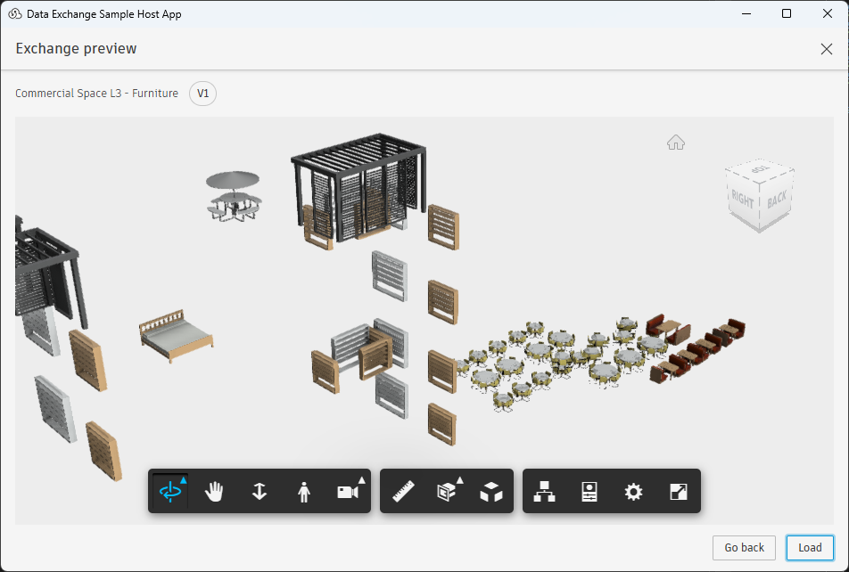

# Autodesk Data Exchange Connector UI Sample

[](http://developer.autodesk.com/)


A comprehensive **WPF-based sample application** demonstrating how to integrate the Autodesk Data Exchange SDK's Connector UI components into a desktop application. This sample provides a complete reference implementation for building Windows applications that create and manage data exchanges.

## Table of Contents

-   [Overview](#overview)
-   [Features](#features)
-   [Architecture](#architecture)
-   [Screenshots](#screenshots)
-   [Prerequisites](#prerequisites)
-   [Installation](#installation)
-   [Configuration](#configuration)
-   [Usage](#usage)
-   [Project Structure](#project-structure)
-   [Key Components](#key-components)
-   [Sample Data](#sample-data)
-   [Testing](#testing)
-   [API Reference](#api-reference)
-   [Further Reading](#further-reading)
-   [License](#license)

## Overview

This sample application demonstrates the integration of the **Autodesk Data Exchange SDK** with a Windows desktop application using WPF. It showcases how to:

-   Embed the Data Exchange Connector UI within your application
-   Implement PKCE OAuth2 authentication with Autodesk Platform Services
-   Create and manage data exchanges programmatically
-   Handle multiple 3D file formats (STEP, IFC, OBJ, Mesh API)
-   Provide real-time progress feedback and notifications
-   Implement custom read/write models for exchange operations

**Target Audience**: Developers building Windows desktop applications that need to integrate with Autodesk's construction and design workflows.

## Features

### 🎨 **Connector UI Integration**

-   Integrate Data Exchange Connector UI within your WPF or WinForm application
-   Real-time notifications and progress tracking
-   Integrated 3D model preview for exchange selection

### 🔐 **Authentication & Security**

-   PKCE OAuth2 implementation with APS (Autodesk Platform Services)

### 🔄 **Exchange Management**

-   Create new exchanges with custom metadata
-   Update existing exchanges with new revisions
-   Download and cache exchange data locally
-   Search and filter exchanges with advanced criteria

## Screenshots

### Home Screen with Exchange Creation

The Connector UI provides a comprehensive workflow with four distinct screens:

-   **Home Screen**: Entry point with project and exchange navigation
-   **Tooltip Notifications**: Real-time feedback and status updates
-   **Create Exchange**: Interactive creation workflow
-   **Exchange Management**: Browse and manage existing exchanges


### Integrated 3D Preview

View and inspect 3D models directly within the Connector UI using the APS Viewer, without leaving the application interface.



### Search and Selection Tools

Familiar search and selection interface that mirrors the user experience from Autodesk's hero applications like Revit, providing intuitive navigation and filtering capabilities.


## Prerequisites

### Development Environment

-   **Visual Studio 2019** or later (recommended: Visual Studio 2022)
-   **.NET Framework 4.8** or **.NET 8.0** SDK
-   **Windows 10** or later (x64 architecture)

### Autodesk Platform Services

1. **APS Developer Account**: [Register here](https://aps.autodesk.com/myapps/)

2. **Application Registration**: Create an app with the following scopes:

    - Data Management API
    - Data Exchange API

3. **Autodesk Construction Cloud**: Active ACC account to store created exchange or load exchanges from

### Required Credentials

-   **Client ID**: From your APS application
-   **Callback URL**: Default: `http://127.0.0.1:63212/`

## Installation

### 1. Clone the Repository

```bash
git clone https://github.com/autodesk-platform-services/aps-dataexchange-connector.git
cd aps-dataexchange-connector
```

### 2. Install Data Exchange SDK

Follow the [official SDK installation guide](https://aps.autodesk.com/en/docs/dx-sdk-beta/v1/developers_guide/installing_the_sdk/#procedure) to add the NuGet package source in Visual Studio.

### 3. Restore NuGet Packages

1. Open `src/SampleConnector.sln`
2. Right-click on the solution → **Restore NuGet Packages**
3. Build the solution (`Ctrl+Shift+B`)

## Configuration

### 1. Application Configuration

Edit `src/App.Debug.config` (for Debug builds) or `src/App.Release.config` (for Release builds):

```xml
<configuration>
    <appSettings>
        <add key="AuthClientId" value="YOUR_CLIENT_ID" />
        <add key="AuthCallback" value="http://127.0.0.1:63212/" />
        <add key="ConnectorName" value="Your Connector Name" />
        <add key="ConnectorVersion" value="1.0.0" />
        <add key="HostApplicationName" value="Your Host App" />
        <add key="HostApplicationVersion" value="1.0.0" />
        <add key="LogLevel" value="Info" />
    </appSettings>
</configuration>
```

### 2. Configuration Parameters

| Parameter                | Description                     | Required |
| ------------------------ | ------------------------------- | -------- |
| `AuthClientId`           | APS application Client ID       | ✅ Yes   |
| `AuthCallback`           | OAuth2 redirect URI             | ✅ Yes   |
| `ConnectorName`          | Display name for your connector | ❌ No    |
| `ConnectorVersion`       | Version of your connector       | ❌ No    |
| `HostApplicationName`    | Name of your host application   | ❌ No    |
| `HostApplicationVersion` | Version of your host app        | ❌ No    |
| `LogLevel`               | Debug, Info, Warning, Error     | ❌ No    |

## Usage

### 1. Launch the Application

1. Build and run the solution from Visual Studio
2. The application opens a web browser for APS authentication
3. Sign in with your Autodesk credentials
4. The Connector UI appears within the sample application

### 2. Create an Exchange

1. Click **Create Exchange** in the UI
2. Programmatically add metadata and properties (in your custom exchange model)
3. Publish to Autodesk Construction Cloud

### 3. Manage Exchanges

-   **View Exchanges**: Browse existing exchanges from your ACC projects
-   **Update Exchanges**: Add new revisions to existing exchanges
-   **Download**: Retrieve exchange data in various formats
-   **Preview**: View 3D models directly in the UI

## Key Components

### `CustomReadWriteModel`

**Purpose**: Core implementation of exchange operations

-   Inherits from `BaseReadWriteExchangeModel`
-   Manages local exchange cache
-   Handles progress notifications
-   Implements geometry download/upload
-   Programmatically retrieve and add data to exchange data model

### `CreateExchangeHelper`

**Purpose**: Utility for creating sample geometry and exchanges

-   Supports multiple geometry formats
-   Generates test exchanges with varied content
-   Demonstrates best practices for element creation

### `SampleHostWindow`

**Purpose**: Main WPF window and application coordinator

-   Initializes the Data Exchange SDK
-   Configures authentication
-   Hosts the Connector UI via `IInteropBridge`
-   Manages application lifecycle

### Manual Testing Scenarios

1. **Authentication Flow**: Test OAuth2 login/logout
2. **Exchange Operations**: Create, update, and load exchanges
3. **UI Responsiveness**: Verify progress indicators and notifications

## API Reference

### Primary SDK Classes Used

| Class                    | Namespace                                  | Purpose                         |
| ------------------------ | ------------------------------------------ | ------------------------------- |
| `IInteropBridge`         | `Autodesk.DataExchange.UI.Core.Interfaces` | Main UI integration point       |
| `ElementDataModel`       | `Autodesk.DataExchange.DataModels`         | Geometry and metadata container |
| `IClient`                | `Autodesk.DataExchange.Interface`          | Core SDK client                 |
| `DataExchange`           | `Autodesk.DataExchange.Core.Models`        | Exchange data structure         |
| `SDKOptionsDefaultSetup` | `Autodesk.DataExchange`                    | Configuration setup             |

## Further Reading

### Official Documentation

-   [Autodesk Data Exchange SDK Documentation](https://aps.autodesk.com/en/docs/dx-sdk-beta/v1/developers_guide/overview/)
-   [Autodesk Platform Services Developer Portal](https://aps.autodesk.com/)
-   [Data Exchange API Reference](https://aps.autodesk.com/en/docs/dx-sdk-beta/v1/reference/)

### Related Samples

-   [Console-based Data Exchange Sample](https://github.com/autodesk-platform-services/aps-dataexchange-console) - For non-UI implementations
-   [APS Tutorials](https://tutorials.autodesk.io/) - Additional platform samples

### Community Resources

-   [APS Developer Forum](https://forums.autodesk.com/t5/autodesk-platform-services/ct-p/autodesk-platform-services)
-   [Autodesk Developer Blog](https://aps.autodesk.com/blog)

## License

This sample code is part of the **Autodesk Data Exchange .NET SDK** beta program and is subject to the license terms covering the SDK. Please refer to the SDK license agreement for complete terms and conditions.

## Support

For technical support and questions:

-   **SDK Issues**: Contact Autodesk Developer Support
-   **Sample Issues**: Create an issue in this repository
-   **General Questions**: Use the [APS Developer Forum](https://forums.autodesk.com/t5/autodesk-platform-services/ct-p/autodesk-platform-services)
